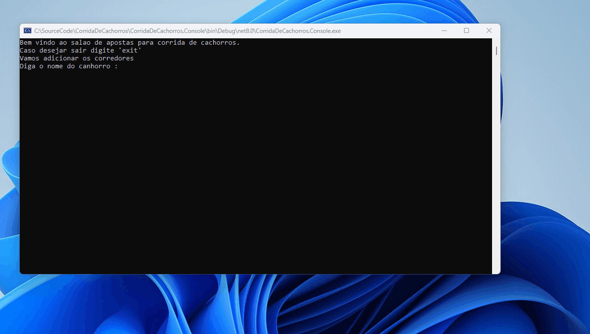

# bk-app-oop-corrida

O exercício envolve a criação de uma simulação de corrida de apostas. Inicialmente, o sistema deve solicitar o número de apostadores que participarão da partida, assegurando que haja pelo menos cinco apostadores, cada um começando com um saldo inicial de R$ 20,00. Além disso, o sistema precisa obter a quantidade de corredores na casa de apostas, garantindo um mínimo de quatro corredores.

Cada corredor possui um comportamento de movimento específico. Um corredor pode se mover aleatoriamente entre 0 cm e 70 cm, outro entre 30 cm e 50 cm, outro entre 20 cm e 40 cm, e o último entre 10 cm e 60 cm. Os apostadores devem escolher em qual corredor apostar antes do início da corrida.

A corrida continua até que um dos corredores atinja a marca de 100 metros, sendo declarado o vencedor. O prêmio da corrida é dividido entre os apostadores que apostaram no corredor vencedor. Após o término da corrida, o sistema deve exibir a colocação final de todos os corredores e o saldo final de cada apostador, refletindo os ganhos ou perdas decorrentes das apostas.

## Simulação de Corrida de Apostas

### Cenários de Teste

#### Funcionalidade: Configuração de Apostas

##### Cenário: Definir número de apostadores
- **Dado que** o sistema está pronto para iniciar a configuração
- **Quando** o usuário informa o número de apostadores
- **Então** o sistema deve verificar se há no mínimo 5 apostadores
- **E** cada apostador deve começar com R$ 20,00

##### Cenário: Definir número de corredores
- **Dado que** o sistema está pronto para iniciar a configuração
- **Quando** o usuário informa o número de corredores
- **Então** o sistema deve verificar se há no mínimo 4 corredores

#### Funcionalidade: Movimento dos Corredores

##### Cenário: Movimento aleatório dos corredores
- **Dado que** a corrida está em andamento
- **Quando** iniciar uma nova rodada
- **Então** o Corredor 1 deve mover entre 0 cm e 70 cm
- **E** o Corredor 2 deve mover entre 30 cm e 50 cm
- **E** o Corredor 3 deve mover entre 20 cm e 40 cm
- **E** o Corredor 4 deve mover entre 10 cm e 60 cm

#### Funcionalidade: Apostas

##### Cenário: Registro de apostas
- **Dado que** o sistema está pronto para receber apostas
- **Quando** cada apostador informa em qual corredor irá apostar
- **Então** o sistema deve registrar a aposta de cada apostador

#### Funcionalidade: Determinar o Vencedor

##### Cenário: Finalização da corrida
- **Dado que** a corrida está em andamento
- **Quando** um corredor atingir 100 metros
- **Então** o sistema deve declarar esse corredor como o vencedor
- **E** dividir o prêmio entre os apostadores que apostaram no corredor vencedor

#### Funcionalidade: Exibição dos Resultados

##### Cenário: Exibir resultados finais
- **Dado que** a corrida terminou
- **Quando** todos os corredores cruzarem a linha de chegada
- **Então** o sistema deve exibir a colocação final dos corredores
- **E** o saldo final de cada apostador

## Dicas
- Crie um projeto console para rodar
- Crie um projeto class library para suas classes
- Crie um projeto de teste

